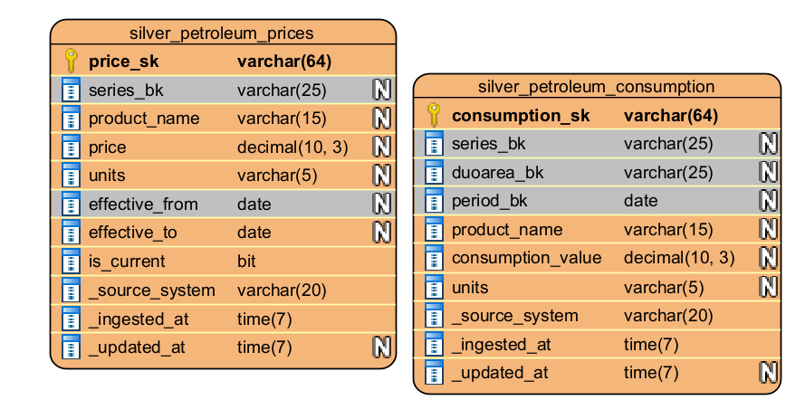

# Silver Layer

## Schema design

* `petroleum_consumption` (SCD1): `consumption_sk`, BK `series_bk+duoarea_bk+period_bk`, `product_bk`/`units` as descriptive attrs, `consumption_value`, metadata cols
* `petroleum_prices` (SCD2): `price_sk`, BK `series_bk+effective_from`, `product_name`/`units` as descriptive attrs, `price`, `effective_from`/`effective_to`/`is_current`
* SCD1 vs SCD2: consumption values are corrected facts (no need to keep wrong old value); prices are a time series where history *is* the point
* Grain confirmed by profiling Bronze (no duplicates on full key; `product`/`product_name`/`units` are functionally dependent on the key, not part of it), not assumed from source schema

## Surrogate keys

`sha2(business_key, 256)` instead of `IDENTITY` – deterministic (safe on MERGE re-run, no ID gaps/dupes), computable on the source side before MERGE. SHA-256 over MD5: no practical collisions at this scale.

## Deduplication
`row_number()` over BK, ordered by `ingestion_timestamp desc`, keep latest – guards against re-ingested/overlapping source files.

## MERGE
Consumption: single MERGE, update only if value changed. Prices: two-step MERGE (close current version -> insert new), since one MERGE can't update and insert against the same key. `effective_to`/`is_current` derived via `LEAD()` per series.

## Schema enforcement & evolution
Verified: type mismatch and unknown column rejected without `mergeSchema`; accepted with it (old rows backfilled `NULL`). Same pattern for type widening (`enableTypeWidening`). Column mapping enabled – rename/drop confirmed as metadata-only via `DESCRIBE HISTORY`.

## Data contracts (discussion)
`mergeSchema` silently absorbs producer changes. A contract fails loudly, before data lands.

## Reliability
MERGE idempotent – update conditions only fire on actual value change; re-run produces 0 updated/inserted.

## Job scheduling
Single Job: `environment`/`config_path` as Job-level parameters (widgets), avoiding hardcoding and per-task duplication.

## Table maintenance
`OPTIMIZE` + `VACUUM` (7-day retention) after each run. Liquid Clustering tested in dev only (not prod) – 14 series, <1MB, too small/low-cardinality for measurable benefit. ZORDER not implemented – superseded by Liquid Clustering per Databricks guidance.

## Data quality
`TRY_CAST` on `period`/`value` (0 failures on this dataset). CHECK constraints (confirmed sufficient, no separate DQ table needed per instructor): `valid_price`, `current_consistency`, `valid_consumption_value` – verified rejecting bad values with `DELTA_VIOLATE_CONSTRAINT_WITH_VALUES`.
