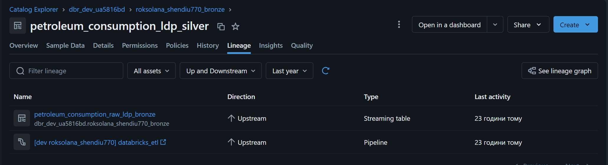
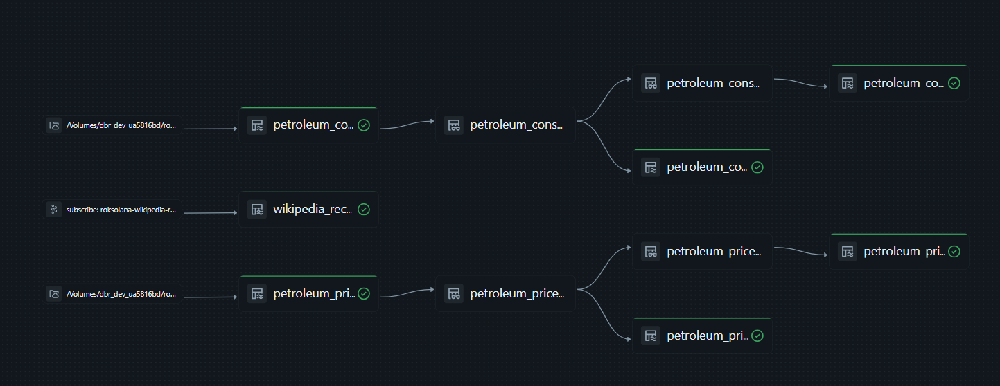
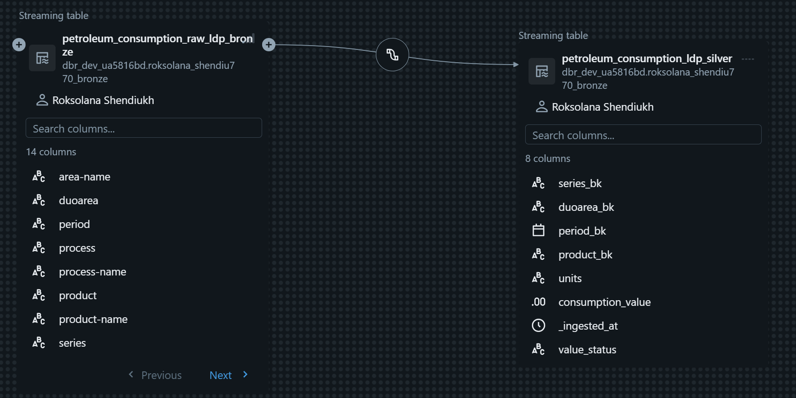
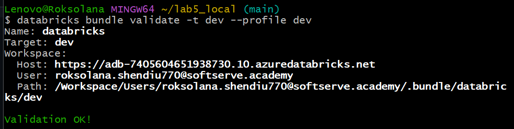

# Lab 5 – Lakeflow

## Pipeline Sources
- **Streaming**: `wikipedia_recentchange` via Kafka-compatible Event Hub subscription
- **Batch/incremental**: `petroleum_consumption` and `petroleum_prices` via Auto Loader (`cloudFiles`), since the source updates weekly

## Design Highlights
- **Bronze**: append-only, `pipelines.reset.allowed=false`, explicit `rescue` schema evolution mode – protects Auto Loader/Kafka checkpoint state from accidental full refresh, and prevents malformed records from breaking the pipeline.
- **Silver + Data Quality**: `expect_all_or_drop` expectations validate raw values *before* casting, paired with a dedicated **quarantine table** per source – rejected records are preserved for investigation instead of silently dropped.
- **SCD strategy chosen per business semantics**: `consumption` uses SCD Type 1 (facts per period, no history needed); `prices` uses SCD Type 2 (price changes need to be tracked over time).
- **Lineage**: fully visible in Unity Catalog (Catalog Explorer ->table ->Lineage tab), including the quarantine branch.
- **Deployment**: Databricks Asset Bundle with parameterized `dev`/`prod` targets (catalog, schema, volume paths as variables) – the same deployment unit to be reused for CI/CD in Week 8. Secrets resolved at runtime via `dbutils.secrets`, never exposed in pipeline config.

## Known Trade-off
All three sources are modeled as Lakeflow pipelines running on a **triggered/scheduled** basis rather than continuous streaming. This is intentional: Kafka in production would typically run continuously, but here all sources are scheduled together to control compute cost during development – running them separately would require re-triggering the pipeline multiple times.

## Execution Status
Bundle validated and deployed successfully to `dev` (see screenshots). Pipeline run was blocked by a `COST_CONTROL_ENTITLEMENT_DENIED` error on the academy workspace's serverless compute policy – an infrastructure/entitlement issue, not a pipeline or code defect. Reported separately to the instructor.

## Screenshots

*Lineage tab on `petroleum_consumption_ldp_silver` – upstream lineage from bronze streaming table and pipeline.*

*Full pipeline lineage graph – end-to-end DAG across all three sources, including quarantine branches.*

*Column-level lineage bronze -> silver – bronze raw columns narrowed to typed silver business columns.*

*Bundle deploy output – successful deployment to `dev`.*
