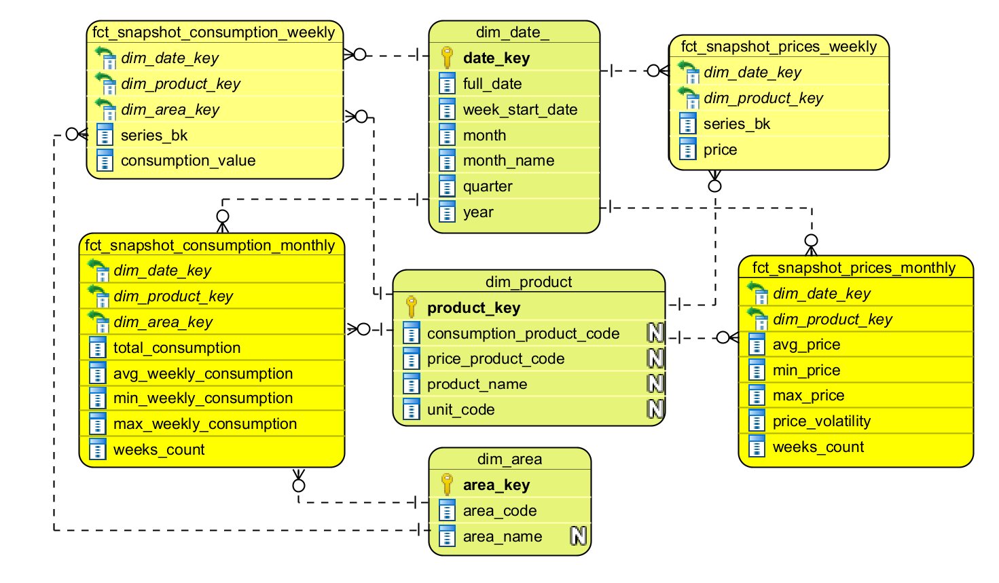

# Lab 6 – Gold Layer 

## Architecture

## Design Highlights

- **Merged product dimension.** EIA uses different product codes for consumption (`petroleum/cons/wpsup`) and prices (`petroleum/pri/gnd`, `petroleum/pri/spt`). `dim_product` stores both `consumption_product_code` and `price_product_code` on one row, so consumption and price facts join directly on `dim_product_key` with no bridge table.
- **`product_price_mapping` as a Delta reference table in Unity Catalog**, not a YAML config. This was chosen over hardcoding or YAML because it gives an audit trail (`DESCRIBE HISTORY`).
- **Explicit `broadcast()` hints** on dimension joins when building weekly facts. The dimension tables are small, so this avoids a shuffle join. Worth noting: Catalyst's cost-based optimizer already auto-broadcasts tables under `spark.sql.autoBroadcastJoinThreshold` (default 10MB), so the explicit hint may be redundant here.
- **Monthly facts only aggregate complete weeks.** Downstream queries filter on `weeks_count >= 4` to avoid a partial, still-accumulating month being mistaken for an anomaly.

## Known Trade-offs

- **Alert/KPI thresholds are static, not data-driven.** The dashboard's green/yellow/red bands and the alert's `-30%` / `-15%` / `10-day staleness` thresholds are fixed values I chose for a plausible-looking demo, not values derived from actual historical volatility. In a real setting these should likely be computed dynamically (e.g., rolling mean/stddev-based bands per product) rather than hardcoded.
- **No trend line on the consumption-vs-price scatter plot.** A regression/trend line would make the correlation between consumption and price easier to read at a glance. The current dashboard widget type doesn't expose an option to overlay one, so it's missing for now.
- **`INNER JOIN` is used when resolving facts against dimensions**, which silently drops any row that fails to resolve. I'm aware this is an ANTI-PATTERN for production: orphaned/unresolved rows should be routed to a DLQ table for investigation rather than dropped, so nothing is lost silently. That DLQ layer isn't implemented here.
- **`product_price_mapping` is stored as a Delta table in Unity Catalog** for the reasons above, but I don't have confidence this matches how mapping/crosswalk tables are actually managed in production data platforms – this is one of the things I'd like to validate with someone more experienced.

## Open Questions

- **Production Code Mapping.** How is product code mapping between heterogeneous data sources typically handled in production pipelines?
- **Architecture comparison with MOLAP.** Coming from a MOLAP background, dashboards read directly from a cube, and drill-down happened automatically when clicking an element. Here dashboards query the Gold layer directly via SQL, with no pre-built cube – is that the standard approach? Cross-filtering and drill-down/drill-through seem to need separate, explicit configuration per widget, which I haven't worked out yet – holding off on further testing for now since dashboards run on serverless and I'd rather not drive up compute while still figuring this out.
- **Cost awareness.** I've seen that I'm currently the second-highest compute consumer in the workspace (after You). I've been trying to be economical where possible, but a lot of iterative testing during development – debugging, re-running pipelines, and the alert simulation – has driven usage up. Are there specific cost constraints or a budget I should be working within for this environment?
